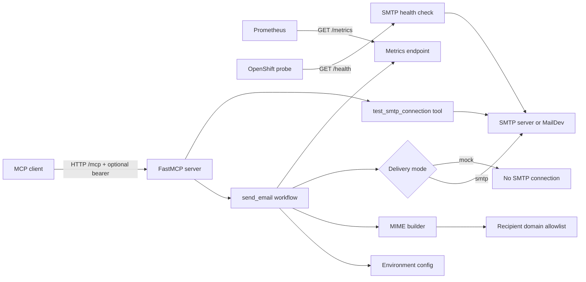

# Architecture

This document describes the Email MCP Server architecture, internal responsibilities, and execution flow for `send_email`.

## Overview

The service exposes an HTTP MCP server powered by FastMCP. The same HTTP process also exposes `/metrics` for Prometheus and `/health` for SMTP connectivity checks. The MCP endpoint can be protected with optional bearer authentication through `MCP_BEARER_TOKEN`. Email delivery is configured entirely through environment variables and can target MailDev locally, a real SMTP server, or mock mode.



## Modules

```text
src/email_mcp/
|-- config/          # Environment loading, parsing, and validation
|-- email/           # Email validation, MIME building, attachments, SMTP
|-- mcp/             # FastMCP server, auth, routes, workflow, progress/logging
|-- observability/   # Prometheus metric definitions and rendering
`-- server.py        # Stable wrapper for fastmcp inspect/run
```

Main responsibilities:

- `config`: converts `os.environ` into `Settings` and `ServerSettings`, then validates booleans, ports, log level, TLS/SSL exclusivity, bearer auth, and regex values.
- `email`: parses recipients, applies the domain allowlist, builds the `EmailMessage`, decodes base64 attachments, and delivers through SMTP.
- `mcp`: configures optional bearer auth, exposes `send_email` and `test_smtp_connection`, handles `ctx.report_progress`, sends FastMCP client logs, and orchestrates delivery.
- `observability`: declares Prometheus counters and histograms, then renders the text payload for `/metrics`.

## MCP Bearer Auth

If `MCP_BEARER_TOKEN` is empty or missing, FastMCP is created without an auth provider and `/mcp` remains open.

If `MCP_BEARER_TOKEN` is set, FastMCP uses a local bearer provider with constant-time comparison and requires this header on the MCP HTTP endpoint:

```http
Authorization: Bearer <MCP_BEARER_TOKEN>
```

This protection applies to the MCP transport (`/mcp`). Operational endpoints `/health` and `/metrics` stay public for Kubernetes/OpenShift probes and Prometheus scraping.

## `send_email` Flow

1. The MCP client calls `send_email` with `to`, `subject`, `text`, and optional fields.
2. The server loads email settings from environment variables.
3. The workflow records a Prometheus attempt and emits the first progress event.
4. `to`, `cc`, and `bcc` recipients are parsed and validated.
5. If `ALLOWED_RECIPIENT_DOMAIN_REGEX` is set, every recipient domain must match with `fullmatch`.
6. The MIME message is built with plain text, optional HTML, `Reply-To`, `Cc`, and attachments.
7. If `EMAIL_MOCK_MODE=true`, the workflow returns a mock success without opening an SMTP connection.
8. Otherwise, the message is sent to the configured SMTP server.
9. The workflow records the Prometheus outcome, emits FastMCP logs, and returns `{ ok, message_id, accepted_recipients, mock }`.

## `test_smtp_connection` And `/health` Flow

The `test_smtp_connection` MCP tool and `/health` HTTP endpoint run the same check:

1. Load and validate SMTP settings.
2. Open an SMTP or SMTP SSL connection.
3. Run STARTTLS if `SMTP_USE_TLS=true`.
4. Log in if `SMTP_USERNAME` is configured.
5. Send `NOOP`.
6. Return a non-sensitive JSON payload.

`/health` returns `200` when the check succeeds and `503` when configuration or SMTP connectivity fails. Mock mode does not bypass this check because the endpoint is meant to validate access to the configured SMTP server.

## Security And Privacy

- `bcc` is used only in the SMTP envelope and is never added to MIME headers.
- FastMCP and Python logs do not include `SMTP_PASSWORD`, `MCP_BEARER_TOKEN`, email bodies, base64 content, metric labels based on subjects, or attachment names.
- Prometheus labels stay low-cardinality: `mode` and `result`.
- The Docker image runs as non-root `appuser` with UID/GID `1000`.
- Docker Compose enables `read_only: true`, `cap_drop: ALL`, `no-new-privileges:true`, and a `/tmp` tmpfs mount.

## OpenShift

The service is prepared for OpenShift deployment with Docker Compose parity and a Helm chart. The Kubernetes chart is in `charts/email-mcp` and its documentation is in `docs/helm.md`.

The expected runtime uses:

- `runAsNonRoot: true`
- `runAsUser: 1000`
- `runAsGroup: 1000`
- `readOnlyRootFilesystem: true`
- `allowPrivilegeEscalation: false`
- `capabilities.drop: ["ALL"]`
- temporary volume mounted on `/tmp`

If the cluster enforces arbitrary UIDs through a restrictive SCC, either adjust the SCC or evolve the image to support arbitrary UIDs instead of the explicit `appuser` UID `1000` constraint.

## Prometheus Metrics

Endpoint:

```text
GET /metrics
```

Business metrics:

- `email_mcp_email_send_attempts_total`
- `email_mcp_email_send_results_total`
- `email_mcp_email_send_duration_seconds`
- `email_mcp_email_recipients_per_send`
- `email_mcp_email_attachments_per_send`

Labels:

- `mode`: `smtp`, `mock`, `unknown`
- `result`: `success`, `config_error`, `validation_error`, `smtp_error`, `network_error`, `unexpected_error`

## Technical Decisions

- HTTP is the primary transport to support Docker Compose, OpenShift, and Prometheus.
- Mock mode keeps all validations active so policies can be tested without SMTP side effects.
- The domain allowlist regex applies to SMTP envelope recipients (`to`, `cc`, `bcc`), not to `reply_to` or `SMTP_FROM`.
- The Docker runtime calls `/app/.venv/bin/email-mcp` directly, without `uv run`, to avoid unnecessary startup writes or dependency resolution.
