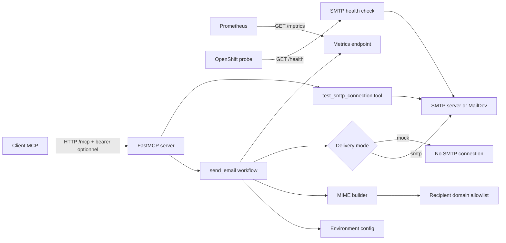

# Architecture

Ce document decrit l'architecture du serveur Email MCP, ses responsabilites internes et le flux d'execution d'un appel `send_email`.

## Vue d'ensemble

Le service expose un serveur MCP HTTP avec FastMCP. Le meme serveur HTTP expose aussi `/metrics` pour Prometheus et `/health` pour verifier la connectivite SMTP. L'endpoint MCP peut etre protege par auth bearer optionnelle via `MCP_BEARER_TOKEN`. L'envoi email est configure uniquement par variables d'environnement et peut cibler MailDev en local, un SMTP reel, ou le mock mode.



## Modules

```text
src/email_mcp/
├── config/          # Chargement, parsing et validation des variables d'environnement
├── email/           # Validation email, construction MIME, pieces jointes, SMTP
├── mcp/             # Serveur FastMCP, route /metrics, workflow, progress/logging
├── observability/   # Definition et exposition des metrics Prometheus
└── server.py        # Wrapper stable pour fastmcp inspect/run
```

Responsabilites principales :

- `config`: transforme `os.environ` en objets `Settings` et `ServerSettings`, valide les booleens, ports, log level, TLS/SSL et regex.
- `email`: parse les destinataires, applique l'allowlist de domaines, construit l'objet `EmailMessage`, decode les pieces jointes base64 et livre via SMTP.
- `mcp`: configure l'auth bearer optionnelle, expose les outils `send_email` et `test_smtp_connection`, gere `ctx.report_progress`, les logs client FastMCP et l'orchestration d'envoi.
- `observability`: declare les compteurs et histogrammes Prometheus, puis rend le payload texte de `/metrics`.

## Auth bearer MCP

Si `MCP_BEARER_TOKEN` est vide ou absent, FastMCP est cree sans fournisseur d'authentification et `/mcp` reste ouvert.

Si `MCP_BEARER_TOKEN` est defini, le serveur FastMCP utilise un provider bearer local avec comparaison constant-time et exige l'en-tete suivant sur l'endpoint MCP HTTP :

```http
Authorization: Bearer <MCP_BEARER_TOKEN>
```

Cette protection s'applique au transport MCP (`/mcp`). Les endpoints operationnels `/health` et `/metrics` restent publics pour les probes Kubernetes/OpenShift et le scraping Prometheus.

## Flux `send_email`

1. Le client MCP appelle `send_email` avec `to`, `subject`, `text`, et les champs optionnels.
2. Le serveur charge la configuration email depuis les variables d'environnement.
3. Le workflow enregistre une tentative Prometheus et emet le premier progress event.
4. Les destinataires `to`, `cc`, `bcc` sont parses et valides.
5. Si `ALLOWED_RECIPIENT_DOMAIN_REGEX` est defini, chaque domaine destinataire doit matcher la regex avec `fullmatch`.
6. Le message MIME est construit avec texte, HTML optionnel, `Reply-To`, `Cc`, et pieces jointes.
7. Si `EMAIL_MOCK_MODE=true`, le workflow retourne un succes mocke sans ouvrir de connexion SMTP.
8. Sinon, le message est envoye au serveur SMTP configure.
9. Le workflow enregistre le resultat Prometheus, emet les logs FastMCP et retourne `{ ok, message_id, accepted_recipients, mock }`.

## Flux `test_smtp_connection` et `/health`

L'outil MCP `test_smtp_connection` et l'endpoint HTTP `/health` executent la meme verification :

1. Charger et valider la configuration SMTP.
2. Ouvrir une connexion SMTP ou SMTP SSL.
3. Executer STARTTLS si `SMTP_USE_TLS=true`.
4. Executer un login si `SMTP_USERNAME` est configure.
5. Envoyer `NOOP`.
6. Retourner un payload JSON non sensible.

`/health` retourne `200` si le test reussit et `503` si la configuration ou la connexion SMTP echoue. Le mock mode ne court-circuite pas ce test, car son objectif est de valider l'accessibilite du serveur SMTP configure.

## Securite et confidentialite

- `bcc` est uniquement utilise dans l'enveloppe SMTP et n'est jamais ajoute aux headers MIME.
- Les logs FastMCP et Python ne contiennent pas `SMTP_PASSWORD`, `MCP_BEARER_TOKEN`, corps email, contenu base64, sujet comme label metric, ni nom de piece jointe comme label metric.
- Les labels Prometheus restent a faible cardinalite : `mode` et `result`.
- L'image Docker s'execute en non-root avec `appuser` UID/GID `1000`.
- Docker Compose active `read_only: true`, `cap_drop: ALL`, `no-new-privileges:true` et un `tmpfs` sur `/tmp`.

## OpenShift

Le service est prepare pour un deploiement OpenShift avec Docker Compose ou Helm. Le chart Kubernetes se trouve dans `charts/email-mcp` et sa documentation est dans `docs/helm.md`.

Le runtime attendu utilise :

- `runAsNonRoot: true`
- `runAsUser: 1000`
- `runAsGroup: 1000`
- `readOnlyRootFilesystem: true`
- `allowPrivilegeEscalation: false`
- `capabilities.drop: ["ALL"]`
- volume temporaire monte sur `/tmp`

Si le cluster impose un UID aleatoire via une SCC restrictive, il faudra soit ajuster la SCC, soit faire evoluer l'image pour supporter un UID arbitraire au lieu de la contrainte explicite `appuser` UID `1000`.

## Metrics Prometheus

Endpoint :

```text
GET /metrics
```

Metrics metier :

- `email_mcp_email_send_attempts_total`
- `email_mcp_email_send_results_total`
- `email_mcp_email_send_duration_seconds`
- `email_mcp_email_recipients_per_send`
- `email_mcp_email_attachments_per_send`

Labels :

- `mode`: `smtp`, `mock`, `unknown`
- `result`: `success`, `config_error`, `validation_error`, `smtp_error`, `network_error`, `unexpected_error`

## Decisions techniques

- Le transport principal est HTTP pour faciliter Docker Compose, OpenShift et Prometheus.
- Le mock mode garde toutes les validations actives afin de tester les politiques sans effet SMTP.
- La regex d'allowlist s'applique aux domaines des destinataires d'enveloppe (`to`, `cc`, `bcc`), pas a `reply_to` ni `SMTP_FROM`.
- Le runtime Docker utilise l'entree `/app/.venv/bin/email-mcp` directement, sans `uv run`, pour eviter des ecritures ou resolutions inutiles au demarrage.
